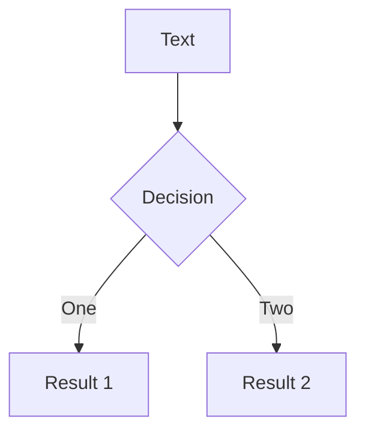

# 循环

---

# while 循环

<div class="grid grid-cols-2 justify-center gap-10 pt-4 mb-6 ">

```py

n = 5
while n > 0 :
    print('Lather')
    print('Rinse')
print('Dry off!')


```




</div>

---

# break

The break statement ends the current loop and jumps to the statement immediately following the loop


```py

while True:
    line = input('> ')
    if line == 'done' : 
       break
    print(line)
print('Done!')

```
---

# continue

The continue statement ends the current iteration and jumps to the top of the loop and starts the next iteration


```py

while True:
    line = input('> ')
    if line[0] == '#' : 
        continue
    if line == 'done' :
        break
    print(line)
print('Done!')

```

---

# for loop 循环

```py

for i in [5, 4, 3, 2, 1] :
    print(i)
print('Finished !!!')

```

